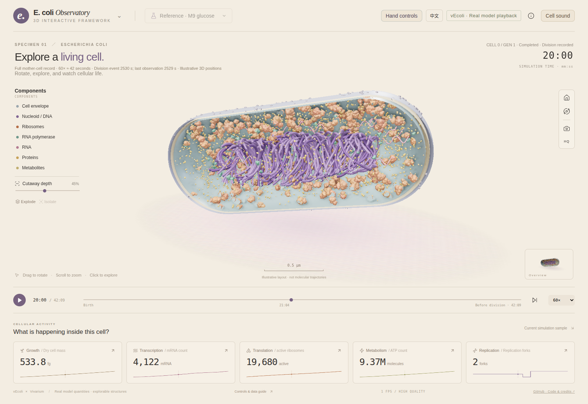

# 3D Interactive Framework

**Explore complex systems in 3D. Reach in with your hands. Hear what changes.**

A browser-based framework starter combining detailed 3D scenes, on-device hand interaction, time navigation and procedural sound. Use it as a starting point for your own scientific, educational or creative data explorer.

Whole-cell models are our first applications — **the framework is not a whole-cell simulator**. The scientific models belong to their original authors.

[中文说明](README.zh-CN.md) · [Quick start](#run-locally) · [Build your own adapter](docs/ADAPTERS.md) · [Credits](THIRD_PARTY_NOTICES.md)

> The intended Pages URL is `https://freakingpotato.github.io/3D_Interactive_Framework/`. It becomes live after the owner enables GitHub Pages (GitHub Actions) and the deployment workflow succeeds. See [deployment](docs/PUBLISHING.md); this README does not claim an unpublished URL is already live.



## What you can reuse

- **3D exploration:** instancing, physical materials, orbit / zoom, sectioning, exploded component views, selection and context opacity; shared protein meshes and distance-based detail in the cell adapter.
- **Local hand interaction:** palm rotation, two-hand zoom, one-second dwell selection, UI interaction and two-hand L-shaped section control. Camera frames stay in the browser.
- **Time navigation:** play, scrub and change speed; immutable frame loading, workers, compressed background caching and a bounded decoded-memory cache.
- **Procedural sonification:** layered non-pitched noise textures, population density, smooth transitions and soloing selected groups. No instrument or voice samples.
- **Ready assets:** local Three.js / MediaPipe files, molecular meshes, structure surfaces and hand models. No asset generation is required to try the project.
- **Two languages** in the cell applications, with explicit model provenance and representation limits.

## Included examples

| Example | Included data | What it demonstrates |
|---|---|---|
| **vEcoli** | Complete baseline mother-cell observations, 0–2529 s; division event at 2530 s | Quantitative model adapter with an illustrative 3D layout |
| **4D Minimal Cell / JCVI-syn3A** | Official replicate 1, 262 spatial snapshots, 0–7200 s including binary fission | Native voxel-centered spatial data; every recorded particle retained |
| **Particle Lab** | Synthetic populations generated in-browser | A small non-biological adapter using the same hand / scene / sound modules |

Default playback is **60×**: the minimal-cell cycle takes about two minutes; select **120×** for about one minute. Its native occupancy grid first separates into two large disconnected regions at **6676 s**. vEcoli provides a division event, not measured daughter-cell geometry.

The two scientific data clips together are about **163 MB compressed**. Optional protein structures and camera models load when needed. The complete static package is larger because it includes ready-to-use assets. The demo runs no solver and has no live experiment endpoint.

## Run locally

Python 3.10+ and a current desktop browser with WebGL2 are enough for the included demos:

```sh
git clone https://github.com/FreakingPotato/3D_Interactive_Framework.git
cd 3D_Interactive_Framework
python3 scripts/build_site.py --out _site
python3 -m http.server 8766 --bind 127.0.0.1 --directory _site
```

Open **http://localhost:8766/**. On Windows use `py -3` in place of `python3`.

- Switch between the two cell systems using the upper-left title.
- Try the non-cell example at **http://localhost:8766/examples/particle-lab/**.
- Enable sound explicitly. A paused state can be previewed for six seconds.
- Enable the camera only if you want gestures; mouse and keyboard remain available.
- Camera access requires localhost or HTTPS. Sound may require a mouse click because of browser autoplay rules.

No Node installation, Python packages, GPU server, Blender or WCM model installation is required for these packaged examples. To modify / test JavaScript, install Node.js 22+ and run `npm ci && npm test`.

For remote hosts, forward the port instead of exposing a solver service:

```sh
ssh -N -L 8766:127.0.0.1:8766 YOUR_USER@YOUR_HOST
```

[Detailed local deployment, larger datasets and optional live backends](docs/LOCAL_DEPLOYMENT.md).

## Adapt it to your project

Start with [`examples/particle-lab/app.js`](examples/particle-lab/app.js), not the cell backend. It creates an ordinary Three.js scene, binds the shared gesture bridge, exposes a small timeline/selection adapter, and supplies its own sound profiles.

```text
Your data → adapter → component groups + state + timeline
                         ↓
                  3D scene / selection
                         ↕
                  hand + mouse input
                         ↓
                  procedural sound
```

Reusable modules live in `dist/` (readable JavaScript source, despite the folder name). `gesture-scene.js`, `hand-gestures.js`, `hand-interactions.js`, `cell-sound.js` and the frame cache can be reused individually. `app.js`, `minimal-app.js` and their scene files are the two domain-specific applications. This is an early framework starter, **not yet a stable general-purpose SDK**; the hand-control panel still expects documented DOM controls. [Adapter contract and integration guide](docs/ADAPTERS.md).

## Performance and interpretation

A full minimal-cell trajectory contains 7,201 frames; downloading and decoding everything into RAM is inappropriate for ordinary browsers. This version keeps decoded geometry in a **128 MiB / 12-frame LRU**, a **48 MiB compressed in-memory cache**, and a **768 MiB bounded persistent raw-frame cache**. Background downloading stops at **512 MiB per selected trajectory**. The sampled full-cycle demo fits within these raw-cache limits. Browser quotas can prevent persistence; foreground playback remains available.

Frames are prepared in a worker and ordinary instanced meshes are reused. Downloading everything does not eliminate GPU draw time or the cost of updating instance transforms. Rendering performance depends on scene complexity and the viewer's GPU; no universal frame-rate claim is made.

vEcoli positions are illustrative. Minimal-cell positions preserve original voxel centers, but molecular glyphs / orientations are illustrative. Protein surfaces are static sequence-matched predictions. Sound maps quantities and available activity states; it is not a recording or an individual reaction detector. See [scientific credit and transformations](THIRD_PARTY_NOTICES.md).

## License and credit

Original framework code: **[Apache-2.0](LICENSE)** with **[NOTICE](NOTICE)**. Free to use, modify and distribute, including commercially, subject to license conditions. Preserve applicable copyright, license and attribution notices when redistributing. Scientific data and third-party assets retain their own licenses; notably the minimal-cell clip and AlphaFold-derived structures are **CC BY 4.0**.

If this framework helps your project, please link back and cite [CITATION.cff](CITATION.cff). We appreciate visible project credit and scientific citation; these requests do not add a mandatory home-page badge requirement to Apache-2.0.

**Credit the models separately:** [Covert Lab / vEcoli](https://github.com/CovertLab/vEcoli); [Thornburg, Maytin et al. / 4D minimal cell](https://doi.org/10.1016/j.cell.2026.02.009), [Zenodo data](https://doi.org/10.5281/zenodo.15579159); [Google DeepMind / EMBL-EBI AlphaFold DB](https://alphafold.ebi.ac.uk/). We did not develop these scientific models and do not imply their authors endorse this interface.

Contributions, new adapters and measured performance improvements are welcome. If the project is useful, a star helps other builders find it.
